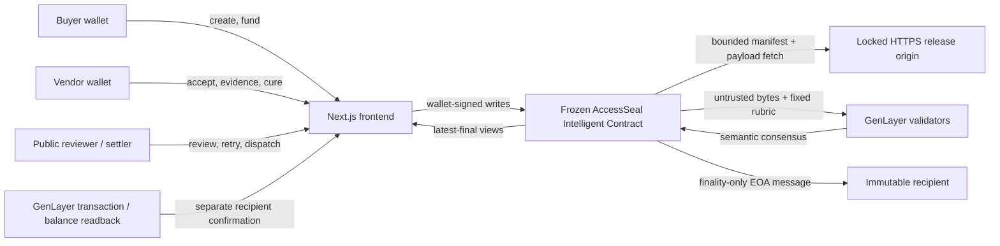

# AccessSeal architecture

## Decision and consequence

**Decision:** for one immutable case epoch and release-manifest digest, do the complete hash-verified HTML, screenshot, DOM facts, scanner report, and critical-flow trace establish the locked accessibility acceptance profile, establish a material blocker, require curable evidence, or remain unreliable?

**Consequence:** after protocol finality, `APPROVED` authorizes only an immutable vendor payout intent; `REJECTED` authorizes only an immutable buyer refund intent. `REQUEST_MORE_INFO` and `UNRESOLVED` move no value. An eligible intent can be dispatched once while preserving:

```text
totalDeposits = reserved + pendingDispatch + dispatchedPayouts + dispatchedRefunds
```

## Components



The frontend is an adapter and display layer. It does not compute verdicts, settlement eligibility, recipients, amounts, or terminal state. Its local case-ID list and review-transaction binding are conveniences; material state always comes from finalized contract views.

## Evidence verification pipeline

An epoch begins with exactly one canonical `accessseal-release-manifest/1` JSON artifact. Its SHA-256 is both the manifest envelope payload hash and `releaseDigest`. The manifest binds `caseId`, epoch, origin, profile hash, and a bounded ordered file list.

Each leader and validator independently:

1. requires a fresh envelope for the manifest and five mandatory artifacts;
2. fetches six exact same-origin HTTPS URIs;
3. checks HTTP success, non-empty bounded bodies, SHA-256, media type, canonical manifest membership, case/epoch/origin/profile, order, and uniqueness;
4. parses finite object-shaped JSON, UTF-8 HTML, and PNG signature as appropriate;
5. submits actual bounded artifacts to the fixed semantic rubric with an explicit untrusted-data boundary;
6. accepts only a strictly bound, bounded verdict result and semantic agreement.

Missing/stale evidence becomes `REQUEST_MORE_INFO`. Unavailable, conflicting, malformed, hash-mismatched, or unstable evidence becomes `UNRESOLVED`. Neither can authorize value movement.

GenVM v0.2.16 buffers each response before contract code can enforce its post-fetch size cap and exposes no timeout/streaming API. AccessSeal therefore uses exactly six requests per adjudicator and explicit per-item/aggregate post-fetch caps, but does not claim transport-level protection.

## State and finality

```text
DRAFT -> FUNDED -> EVIDENCE_OPEN -> EVIDENCE_SEALED -> REVIEW_PENDING -> DECIDED
EVIDENCE_OPEN -> REVIEW_PENDING  (only after the evidence cutoff fallback)
DECIDED -> EVIDENCE_OPEN       (one RMI cure, new epoch)
DECIDED -> REVIEW_PENDING      (bounded unresolved retry)
DECIDED -> SETTLEMENT_PENDING  (finalized APPROVED/REJECTED or recovery refund)
SETTLEMENT_PENDING -> DISPATCHED_FINALIZED
DRAFT/FUNDED/EVIDENCE_OPEN/DECIDED -> CANCELLED (eligible deterministic exits)
```

`close_evidence(caseId)` is a buyer-only write. It is permitted only for the current `EVIDENCE_OPEN` epoch before the hard deadline when the exact six-item profile is complete and fresh: `RELEASE_MANIFEST`, `HTML_BUNDLE`, `SCREENSHOT`, `DOM_FACTS`, `SCANNER_REPORT`, and `CRITICAL_FLOW_TRACE`. It records `evidenceSealed=true`, `evidenceSealedAt`, and `evidenceSealedBy=buyer`, then sets `lifecycle=EVIDENCE_SEALED`. An eligible public reviewer can then call `request_review` immediately. If the buyer does not seal, `request_review` rejects with `review is not eligible before the evidence cutoff` until the evidence cutoff has passed; neither path can cross the hard deadline.

Authoritative `get_case` readback must include the current `epoch`, `lifecycle`, `evidenceDeadline`, `hardDeadline`, `evidenceSealed`, `evidenceSealedAt`, and `evidenceSealedBy`; `get_evidence(caseId, epoch)` provides the six bound envelopes and hashes. The meaningful close errors are `only the buyer can close evidence`, `evidence is not open`, `case hard deadline has expired`, `evidence profile is incomplete`, and `evidence profile contains expired evidence`. A sealed state is only review eligibility—it is not an approval, a review/protocol-finality result, or a settlement result.

The review transaction assigns a deterministic proof ID and emits an authenticated self-message with `on='finalized'`. Only the contract address can invoke `confirm_review_finality`, and stale/forged case/epoch/attempt/proof combinations fail. Historical attempt records retain verdict, proof, decision/finalization timestamps, and status.

`execute_settlement` emits a pure EOA transfer on finality and records `DISPATCHED_FINALIZED`. GenVM v0.2.16 gives the contract no correlated external-child receipt callback. Therefore the IC can prove the finalized parent dispatch but not recipient delivery. GenLayerJS/integration tooling must separately correlate and verify the child transaction or recipient balance delta; the two states must never be merged in UI or proof.

## Public contract surface

Writes:

- `create_case`, `accept_terms`, `fund`
- `open_evidence`, `append_evidence`, `close_evidence`, `request_review`
- `confirm_review_finality` (authenticated self-message only)
- `start_cure`, `retry_review`, `expire_unresolved`, `timeout_refund`
- `prepare_payout`, `prepare_refund`, `execute_settlement`

Views:

- `get_case`, `get_evidence`
- `get_review`, `get_review_attempt`, `get_review_finality`
- `get_settlement`, `get_accounting`
- `canonical_evidence_hash`

There is no owner/admin/upgrader/verdict-override/recipient-mutation method, no case enumeration, no case `createdAt`, and no on-chain store of the originating review/appeal transaction IDs.

## Deployment boundary

The readable contract is deterministically compacted into a tracked deployment artifact with a hard 48,000-byte budget. The pinned builder preserves the dependency header, annotations, `self`, global/public names, storage and ABI; direct tests deploy the artifact and schema parity is mandatory. The artifact exists because Bradbury rejects the readable 73 KB source with `BlockPubdataLimitReached`.

The deployer accepts only an exact network and optional repository root. It independently reads clean Git state, regenerates and byte-compares the artifact, deploys only artifact bytes, waits for finalized successful deployment, reads deployed code/schema/accounting, checks the exact frozen interface hash, then atomically writes an ignored manifest using the v2 manifest format and binding both readable and artifact hashes. The standalone verifier repeats those bindings from current clean `HEAD`.

V3 is deployed to a new address. Its V3 source/schema/readback and new address must be independently verified before client configuration; V2 has no in-place upgrade or automatic migration of cases, evidence, balances, or identifiers.

The tracked deployment manifest is an intentionally invalid example. Local GLSim addresses under `work/` are ephemeral and are not external deployment evidence.
