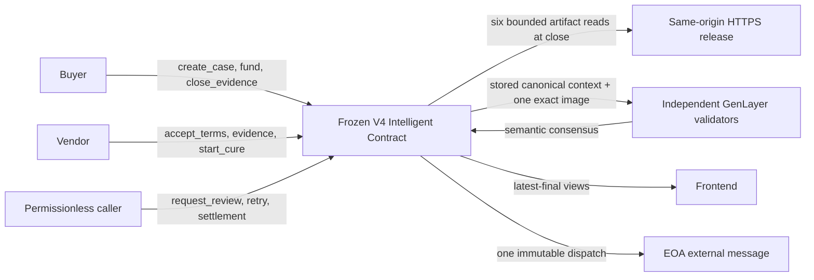

# AccessSeal V4 architecture

## Authority and trust boundary

The V4 Intelligent Contract is `INTENTIONALLY_FROZEN` and authoritative for the evidence domain, review context, verdict, lifecycle, custody, settlement recipient, settlement amount, and terminal state. The frontend keeps only convenience state such as locally known case IDs and a signed-transaction provenance record. It always replaces material UI state with `latest-final` contract readback; it never auto-signs or auto-resubmits a transaction.

## Evidence and V4 context construction

An epoch contains exactly six mandatory evidence types: `RELEASE_MANIFEST`, `HTML_BUNDLE`, `SCREENSHOT`, `DOM_FACTS`, `SCANNER_REPORT`, and `CRITICAL_FLOW_TRACE`. The manifest is `accessseal-release-manifest/1`; its digest is the epoch `releaseDigest` and it binds the case ID, epoch, subject origin, profile hash, and the five artifact members.

At `close_evidence(caseId)`, the buyer alone may seal a complete fresh `EVIDENCE_OPEN` epoch before the hard deadline. The contract reads the manifest and five mandatory artifacts, checks exact same-origin HTTPS membership, media type, SHA-256, schemas, freshness, and all case/epoch/origin/profile bindings. It writes a canonical `accessseal-review-context/1` value only when all checks pass. Failure leaves the epoch unsealed.

The context has a hard **16,384 UTF-8-byte** limit. Its `binding` carries `chainId`, `contractAddress`, `caseId`, `epoch`, `profileHash`, `releaseDigest`, and `subjectOrigin` as independent equivalence fields. It separately lists evidence type/digest pairs and describes the screenshot through `uri`, `sha256`, `mediaType`, and `byteLength`. The `SCREENSHOT` must be an exact manifest-bound PNG of at most **16,384 raw bytes**. Other bounds are: 16,384 bytes per manifest/JSON artifact, 32,768 bytes HTML, 16 manifest files, and 131,072 bytes total fetched artifact bytes.

`get_case` exposes `reviewContextReady` and `reviewContextHash`. `get_review_context(caseId, epoch)` returns the ready flag, canonical JSON/hash, and independent image URI/hash. A client must hash `contextJson`, compare `contextHash` and case fields to `get_case`, then compare `releaseDigest` and evidence hashes to `get_evidence` before offering review.

## Review and consensus

`request_review(caseId)` is permissionless only for a sealed, context-ready current epoch before the hard deadline. It makes **zero** manifest/HTML/DOM/scanner/flow refetches. Per participating node it makes at most **one** fetch of the exact bound screenshot and exactly **one** AI evaluation. The fixed rubric treats website text, markup, URLs, bindings, and supplied artifacts as untrusted data.

Leader and validators independently evaluate the same stored context. Consensus compares only verdict, sorted `materialBlockers`, sorted `missingEvidence`, `profileHash`, `releaseDigest`, `contextHash`, and `evidenceRefs`; rationale prose is deliberately excluded. Permitted verdicts are `APPROVED`, `REJECTED`, `REQUEST_MORE_INFO`, and `UNRESOLVED`. Invalid, contradictory, unavailable, stale, oversized, malformed, or mismatched proof cannot produce `APPROVED`.

The authoritative phases are:

1. A finalized successful `close_evidence` followed by `get_case` and `get_review_context` readback.
2. A signed `request_review`, then `get_review`, `get_review_attempt`, and `get_review_finality` readback.
3. Only status `FINALIZED` with verdict `APPROVED` allows `prepare_payout`; only finalized `REJECTED` allows `prepare_refund`.
4. A signed `execute_settlement(caseId, settlementId)`, then `get_settlement` and `get_accounting` readback.

`REQUEST_MORE_INFO` permits one vendor `start_cure` into a new epoch. `UNRESOLVED` moves no value; anyone can `retry_review` after the cooldown and within the case budget, then `expire_unresolved` can prepare refund after exhaustion. `timeout_refund`, `prepare_payout`, `prepare_refund`, and `execute_settlement` are permissionless only in their exact contract-gated phases.

## Settlement and deployment

Accounting preserves `totalDeposits = reserved + pendingDispatch + dispatchedPayouts + dispatchedRefunds`. Prepared settlement IDs bind recipient, amount, reason, review proof, and epoch. `DISPATCHED_FINALIZED` prevents duplicate dispatch but does not prove a linked child payment succeeded; receipt proof still needs an official linked child transaction or exact recipient balance delta.

V4 is a new deployment with no V1–V3 migration. The compact artifact is verified with `npm run contract:check`; a verified deployment manifest uses schema `accessseal-deployment-manifest/2`, `contractVersion: "V4"`, and `contractClassification: "INTENTIONALLY_FROZEN"`. It is retained beside history under `work/deployments/<network>/v4/<deployment-artifact-sha256>/<contract-address>.json`. Localnet and Bradbury values are simulated testnet value, never proof of a live payment or deployment.
